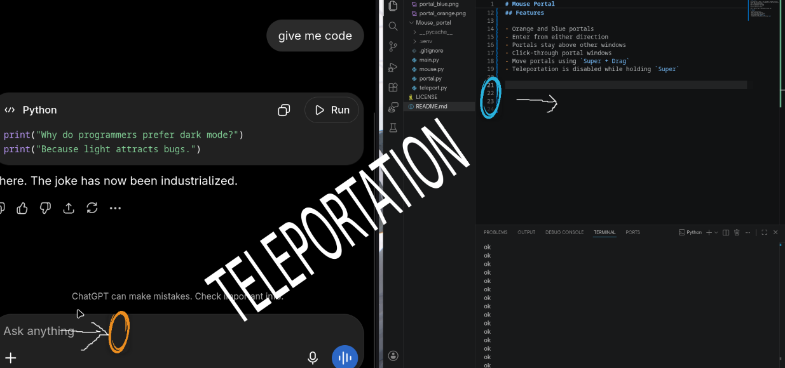

# Mouse Portal

It's a portal for your mouse

I was inspired by the game Portal and thought "i should make this for computers" So I made this software.

It's basically the same thing:

- Enter from orange, exit from blue
- Enter from blue, exit from orange

Basically, a shortcut for your mouse

Built on and for Hyprland on Arch Linux x86_64.

## Features

- Orange and blue portals
- Enter from either direction
- Portals stay above other windows
- Click-through portal windows
- Move portals using `Super + Drag`
- Teleportation is disabled while holding `Super`

## Screenshot



Peak.

## Requirements

- Arch Linux
- Hyprland 0.55+
- Python 3
- PySide6

## Installation

Clone the repo:

```bash
git clone <your-repository-url>
cd Mouse-Portal/Mouse_portal
```

Create Venv
```bash
python -m venv .venv
source .venv/bin/activate
```
pip install PySide6

Usage

Run:
```bash
python main.py
```

Two portals will appear on your desktop.
Move them using:-
Super + Left Mouse Drag

## How It Works

It uses Hyprland's IPC through hyprctl to:

1) Track the current cursor position.
2) Detect when the cursor enters a portal.
3) Move the cursor to the corresponding exit portal.
as easy as that (it was not easy)

# Current Limitations
1) Currently designed specifically for Hyprland.
2) Its kinda useless bcs as a hyprland user i never touch the mouse 

# Special thanks 
Thanks valve for making such awsome games